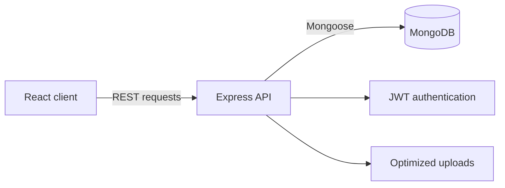

# Restaurant Menu App

A full-stack digital restaurant menu with a public customer experience and a protected administration panel. Visitors can browse categories and products, while restaurant staff can manage menu content, availability, ordering, branding, and images.

## Features

### Public menu

- Browse restaurant categories and products
- Product descriptions, prices, availability, and "new" labels
- Responsive layout and animated transitions
- Restaurant logo, contact information, and image previews

### Administration

- Secure email/password login with JWT sessions
- Create, edit, delete, and reorder categories
- Create, edit, delete, reorder, and mark products unavailable or new
- Upload and replace the restaurant logo
- Automatic image resizing and WebP conversion
- Protected server-side modification endpoints

## Architecture



The repository contains two applications:

- `client/` — React single-page application built with Vite
- `server/` — Express REST API connected to MongoDB

The browser never connects directly to MongoDB. It communicates with Express, and the API validates requests before reading or modifying data.

## Technology stack

| Area | Technologies |
| --- | --- |
| Frontend | React, Vite, React Router, Framer Motion |
| Admin UI | dnd-kit, React Toastify, React Icons |
| Backend | Node.js, Express, Mongoose |
| Database | MongoDB |
| Authentication | JSON Web Tokens, bcrypt |
| Images | Multer, Sharp, WebP |
| Testing | Vitest, Node.js test runner |
| Deployment | Netlify-ready client, Render-ready API |

## Project structure

```text
restaurant-menu-app/
├── client/
│   ├── public/                 Static assets
│   ├── src/admin/              Admin pages and protected routing
│   ├── src/pages/              Public menu and login pages
│   ├── src/api.js              Shared API client
│   ├── src/App.jsx             Client routes
│   └── vite.config.mjs         Vite configuration
├── server/
│   ├── middleware/             Authentication and image processing
│   ├── models/                 Mongoose models
│   ├── routes/                 REST endpoints
│   ├── scripts/                Admin and maintenance scripts
│   ├── test/                   Server tests
│   ├── uploads/                Demo and uploaded menu images
│   └── app.js                  API entry point
├── netlify.toml                Client deployment configuration
└── package.json                Repository-level helper scripts
```

## Prerequisites

- Node.js 22 or newer
- npm
- MongoDB running locally or a MongoDB Atlas connection string

## Local setup

### 1. Install dependencies

From the repository root:

```bash
npm run install:all
```

### 2. Configure the server

Copy `server/.env.example` to `server/.env` and update the values:

```env
MONGO_URI=mongodb://127.0.0.1:27017/restaurant-menu
JWT_SECRET=replace-with-a-long-random-secret
CLIENT_ORIGINS=http://localhost:3000
PORT=5000
ADMIN_EMAIL=admin@example.com
ADMIN_PASSWORD=replace-with-at-least-12-characters
```

### 3. Configure the client

Copy `client/.env.example` to `client/.env`:

```env
VITE_BACKEND_URL=http://localhost:5000
```

### 4. Create the administrator

```bash
npm run create-admin
```

This creates the administrator or updates the password for an existing account with the same email. `ADMIN_PASSWORD` must contain at least 12 characters.

### 5. Start the applications

Terminal one:

```bash
npm run server
```

Terminal two:

```bash
npm run client
```

Open [http://localhost:3000](http://localhost:3000). The admin login is available at [http://localhost:3000/login](http://localhost:3000/login).

## Available scripts

Run these commands from the repository root:

| Command | Purpose |
| --- | --- |
| `npm run install:all` | Install client and server dependencies |
| `npm run client` | Start the Vite development server |
| `npm run server` | Start the Express API |
| `npm run create-admin` | Create or update an administrator |
| `npm test` | Run client and server tests |
| `npm run build` | Create the production client build |

## API overview

| Method | Endpoint | Description |
| --- | --- | --- |
| `GET` | `/api/health` | API health check |
| `POST` | `/api/auth/login` | Administrator login |
| `GET` | `/api/categories` | List menu categories |
| `GET` | `/api/products/kategorija/:id` | List products in a category |
| `GET` | `/api/logo` | Return the current logo |

Category, product, reorder, toggle, and upload mutations require a valid administrator token.

## Tests and production build

```bash
npm test
npm run build
```

The GitHub Actions workflow runs the same checks for pushes and pull requests.

## Deployment

### Client — Netlify

The included `netlify.toml` uses:

- Base directory: `client`
- Build command: `npm run build`
- Publish directory: `dist`

Set this environment variable in Netlify:

```env
VITE_BACKEND_URL=https://your-api.example.com
```

### API — Render or another Node.js host

Use `server` as the root directory, `npm install` as the build command, and `npm start` as the start command. Configure `MONGO_URI`, `JWT_SECRET`, and `CLIENT_ORIGINS` on the hosting platform.

The API stores images under `server/uploads`. Production hosting therefore needs persistent storage. For a larger deployment, use object storage such as Cloudinary, Amazon S3, or Cloudflare R2.

## Security notes

- Real `.env` files are excluded from Git.
- Passwords are hashed with bcrypt.
- Menu modifications require JWT authentication.
- Uploads are restricted by file type and size.
- Images are resized and converted to WebP.
- CORS is restricted through `CLIENT_ORIGINS`.

Never commit MongoDB credentials, administrator passwords, or JWT secrets.

## Future direction

The current application represents one restaurant. A multi-restaurant version should introduce a `Restaurant` model, associate every user/category/product with a `restaurantId`, enforce tenant isolation in every query, and resolve restaurants from verified domains or subdomains.
